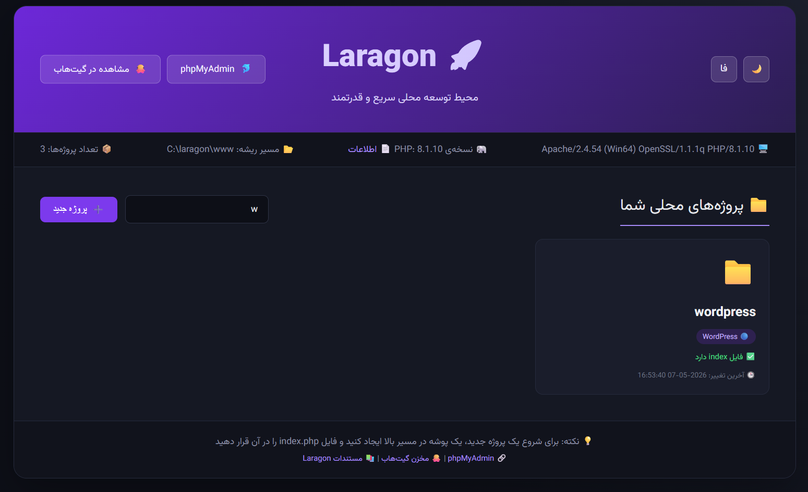

# 🚀 Laragon Dashboard — RTL & Dark Mode

جایگزینی برای صفحه‌ی پیش‌فرض Laragon؛ یک داشبورد فارسی، راست‌چین و تمام دارک که پوشه‌های پروژه رو خودکار شناسایی می‌کنه و نوع فریم‌ورک هر کدوم رو نشون می‌ده.

## ✨ ویژگی‌ها

- راست‌چین کامل (`dir="rtl"`) با فونت Vazirmatn، مناسب کاربران فارسی‌زبان
- تم دارک ثابت با پالت بنفش-آبی تیره، بدون نیاز به تنظیم اضافه
- اسکن خودکار پوشه‌های داخل `www` و نمایش به‌صورت کارت
- تشخیص نوع پروژه از روی فایل‌های مشخصه (Laravel، WordPress، Symfony، Angular، Next.js، Vite، Node.js، Composer)
- جستجوی زنده‌ی پروژه‌ها بدون رفرش صفحه
- لینک مستقیم برای باز کردن هر پروژه در VS Code
- دسترسی به `phpinfo()` فقط از طریق localhost (برای جلوگیری از افشای اطلاعات حساس)
- دسترسی سریع به phpMyAdmin

## 📦 نصب

1. فایل `index.php` رو دانلود کن.
2. توی مسیر ریشه‌ی Laragon (معمولاً `C:\laragon\www`) همون فایل `index.php` پیش‌فرض رو با این فایل جایگزین کن (یه بکاپ از فایل قبلی بگیر، محض احتیاط).
3. Laragon رو اجرا کن و آدرس `http://localhost` رو توی مرورگر باز کن.

همین! نیازی به نصب پکیج یا کانفیگ اضافه نیست، فقط PHP خام و بدون وابستگی خارجیه.

## ⚠️ نکته‌ی امنیتی

دسترسی به `?q=info` (که `phpinfo()` رو نشون می‌ده) به‌صورت پیش‌فرض فقط از `127.0.0.1` مجازه. اگه این پروژه رو روی یه سرور واقعی یا شبکه‌ی اشتراکی دیپلوی کردی، پیشنهاد می‌شه این بخش رو کلاً حذف کنی یا با احراز هویت محدودش کنی.

## 🎨 سفارشی‌سازی

- **پوشه‌های مخفی:** آرایه‌ی `$hiddenFolders` توی تابع `getProjectFolders()` رو ویرایش کن تا پوشه‌های دلخواهت از لیست کنار گذاشته بشن.
- **تشخیص نوع پروژه:** آرایه‌ی `$checks` توی تابع `detectProjectType()` رو می‌تونی گسترش بدی تا فریم‌ورک‌های بیشتری شناسایی بشن.
- **رنگ‌بندی:** متغیرهای رنگ توی بخش `<style>` (مثل `#7c3aed`، `#0d0f17`) رو برای تغییر تم تغییر بده.

## 🤝 مشارکت

اگه باگی پیدا کردی یا ایده‌ای برای بهبود داری، یه Issue یا Pull Request باز کن. خوشحال می‌شم همکاری کنم.

## 📄 لایسنس

این پروژه تحت لایسنس [MIT](LICENSE) منتشر شده؛ آزادانه استفاده، تغییر و توزیع کن.

---

# 🚀 Laragon Dashboard — RTL & Dark Mode (English)

A drop-in replacement for Laragon's default landing page: a Persian, right-to-left, permanently dark dashboard that auto-detects your local project folders and identifies each project's framework.

## ✨ Features

- Full RTL layout (`dir="rtl"`) with the Vazirmatn font, built for Persian-speaking users
- Fixed dark theme with a purple/indigo palette — no toggle, no setup
- Automatic scan of folders inside `www`, rendered as cards
- Project type detection from marker files (Laravel, WordPress, Symfony, Angular, Next.js, Vite, Node.js, Composer)
- Live search filter, no page reload
- One-click "open in VS Code" link per project
- `phpinfo()` is restricted to localhost requests only, to avoid leaking sensitive server info
- Quick access to phpMyAdmin

## 📦 Installation

1. Download `index.php`.
2. Replace the default `index.php` in your Laragon root (usually `C:\laragon\www`) with this file — back up the original first, just in case.
3. Start Laragon and open `http://localhost` in your browser.

No dependencies, no build step — just plain PHP.

## ⚠️ Security note

The `?q=info` route (which exposes `phpinfo()`) only works when requested from `127.0.0.1` by default. If you ever deploy this on a real server or shared network, remove that route entirely or put it behind authentication.

## 🎨 Customization

- **Hidden folders:** edit the `$hiddenFolders` array inside `getProjectFolders()` to exclude folders you don't want listed.
- **Project detection:** extend the `$checks` array inside `detectProjectType()` to recognize more frameworks.
- **Colors:** the theme variables live in the `<style>` block (e.g. `#7c3aed`, `#0d0f17`) — tweak them to restyle the dashboard.

## 🤝 Contributing

Found a bug or have an idea? Feel free to open an issue or pull request.

## 📄 License

Released under the [MIT License](LICENSE) — use, modify, and share freely.
